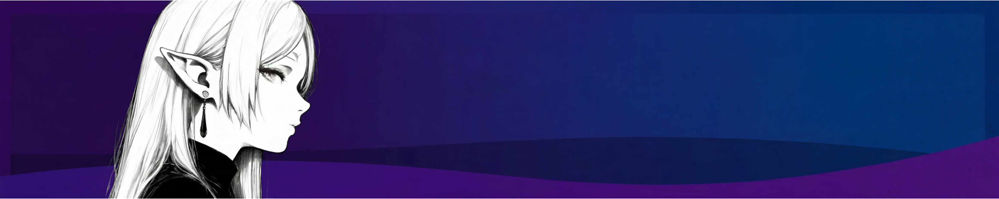

<h1>Hi, I'm t9sy</h1>

## About Me 

Full Stack Developer @ <b><a href="https://serika.dev/profile/6895e3e77c3f72d30ad44963">Serika.dev</a></b>

Currently working on <b><a href="https://serika.app">serika.app</a></b> & <b>serika.chat</b> for <a href="serika.dev">Seika.dev</a>

Learning & Working on: <b>AI Technologies</b>, <b>Web Design</b>, and <b>Privacy-first Applications</b>

Making aesthetic, interactive interfaces.

 

## Tech Stack 

 

  
    
  
    
  
  &nbsp;&nbsp;
  

 

## Projects 

 

<table align="center" style="border-collapse: collapse; border: none; background-color: transparent;">
<tr>
<td width="33%" align="center" valign="top" style="border: none; padding: 10px;">

<h3>serika.app</h3>

A highly privacy-focused search engine.

  

  

</td>
<td width="33%" align="center" valign="top" style="border: none; padding: 10px;">

<h3>serika.chat</h3>

A privacy-focused Discord alternative (In Development).

  

  

</td>
<td width="33%" align="center" valign="top" style="border: none; padding: 10px;">

<h3>Aether</h3>

A privacy-focused Browser (In Development).

  

  

</td>
</tr>
</table>

 

## GitHub Stats 

 

  
  

  

 

## Connect 

 

---

Building Privacy focused projects

  

